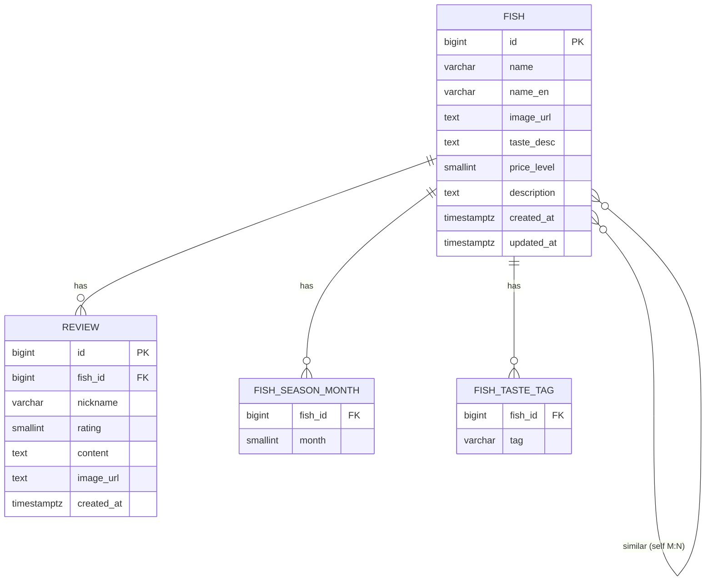

# FishNote — DB 설계서 (PostgreSQL)

> 대상: Codex 구현용. 이 문서의 DDL을 그대로 실행하면 스키마가 생성됨.
> DB: PostgreSQL 16 / ORM: Spring Data JPA (Hibernate)

---

## 1. ERD



---

## 2. 테이블 정의

### `fish` — 생선 (메인)
| 컬럼 | 타입 | 제약 | 설명 |
|---|---|---|---|
| id | BIGSERIAL | PK | |
| name | VARCHAR(100) | NOT NULL | 이름 (예: 광어) |
| name_en | VARCHAR(100) | | 영문/학명 |
| image_url | TEXT | | 대표 사진 URL |
| taste_desc | TEXT | | 맛 설명 문장 |
| price_level | SMALLINT | CHECK 1~3 | 1=저렴 2=중간 3=고급 |
| description | TEXT | | 한 줄 소개 |
| created_at | TIMESTAMPTZ | DEFAULT now() | |
| updated_at | TIMESTAMPTZ | | |

### `review` — 후기 (1:N, fish 1개 ↔ review N개)
| 컬럼 | 타입 | 제약 | 설명 |
|---|---|---|---|
| id | BIGSERIAL | PK | |
| fish_id | BIGINT | FK→fish, NOT NULL | |
| nickname | VARCHAR(30) | NOT NULL | 익명 작성자 |
| rating | SMALLINT | CHECK 1~5 | 별점 (선택) |
| content | TEXT | NOT NULL | 후기 본문 |
| image_url | TEXT | | 사진 (선택) |
| created_at | TIMESTAMPTZ | DEFAULT now() | |

### `fish_season_month` — 제철 월 (컬렉션)
| 컬럼 | 타입 | 제약 |
|---|---|---|
| fish_id | BIGINT | FK→fish |
| month | SMALLINT | CHECK 1~12, PK(fish_id, month) |

> 예: 광어 → (11),(12),(1),(2). 계절 필터는 month로 조회.

### `fish_taste_tag` — 맛 태그 (컬렉션)
| 컬럼 | 타입 | 제약 |
|---|---|---|
| fish_id | BIGINT | FK→fish |
| tag | VARCHAR(30) | PK(fish_id, tag) |

> 예: 광어 → "담백", "쫄깃". 태그 필터는 tag로 조회.

### `fish_similar` — 비슷한 생선 (self N:M)
| 컬럼 | 타입 | 제약 |
|---|---|---|
| fish_id | BIGINT | FK→fish |
| similar_fish_id | BIGINT | FK→fish, PK(fish_id, similar_fish_id) |

---

## 3. DDL (실행용)

```sql
-- 생선
CREATE TABLE fish (
    id          BIGSERIAL PRIMARY KEY,
    name        VARCHAR(100) NOT NULL,
    name_en     VARCHAR(100),
    image_url   TEXT,
    taste_desc  TEXT,
    price_level SMALLINT CHECK (price_level BETWEEN 1 AND 3),
    description TEXT,
    created_at  TIMESTAMPTZ NOT NULL DEFAULT now(),
    updated_at  TIMESTAMPTZ
);

-- 제철 월
CREATE TABLE fish_season_month (
    fish_id BIGINT NOT NULL REFERENCES fish(id) ON DELETE CASCADE,
    month   SMALLINT NOT NULL CHECK (month BETWEEN 1 AND 12),
    PRIMARY KEY (fish_id, month)
);

-- 맛 태그
CREATE TABLE fish_taste_tag (
    fish_id BIGINT NOT NULL REFERENCES fish(id) ON DELETE CASCADE,
    tag     VARCHAR(30) NOT NULL,
    PRIMARY KEY (fish_id, tag)
);

-- 비슷한 생선 (self many-to-many)
CREATE TABLE fish_similar (
    fish_id         BIGINT NOT NULL REFERENCES fish(id) ON DELETE CASCADE,
    similar_fish_id BIGINT NOT NULL REFERENCES fish(id) ON DELETE CASCADE,
    PRIMARY KEY (fish_id, similar_fish_id),
    CHECK (fish_id <> similar_fish_id)
);

-- 후기
CREATE TABLE review (
    id         BIGSERIAL PRIMARY KEY,
    fish_id    BIGINT NOT NULL REFERENCES fish(id) ON DELETE CASCADE,
    nickname   VARCHAR(30) NOT NULL,
    rating     SMALLINT CHECK (rating BETWEEN 1 AND 5),
    content    TEXT NOT NULL,
    image_url  TEXT,
    created_at TIMESTAMPTZ NOT NULL DEFAULT now()
);

-- 인덱스
CREATE INDEX idx_review_fish ON review(fish_id);
CREATE INDEX idx_season_month ON fish_season_month(month);
CREATE INDEX idx_taste_tag ON fish_taste_tag(tag);
CREATE INDEX idx_fish_name ON fish(name);
```

---

## 4. JPA 매핑 노트 (Codex 참고)

- `Fish` 엔티티
  - `@OneToMany(mappedBy="fish")` → `List<Review> reviews`
  - `@ElementCollection` + `@CollectionTable(name="fish_season_month")` → `Set<Integer> seasonMonths`
  - `@ElementCollection` + `@CollectionTable(name="fish_taste_tag")` → `Set<String> tasteTags`
  - `@ManyToMany` (self) + `@JoinTable(name="fish_similar")` → `Set<Fish> similarFishes`
- `Review` 엔티티
  - `@ManyTomany` 아님. `@ManyToOne` → `Fish fish` (`@JoinColumn(name="fish_id")`)
- 연관관계 주의: 무한 직렬화 방지 위해 응답은 **DTO로 변환**해서 내보낼 것 (엔티티 직접 반환 금지)
- `created_at`/`updated_at`은 `@CreationTimestamp` / `@UpdateTimestamp` 또는 JPA Auditing 사용

---

## 5. 시드 데이터 예시 (광어 1건)

```sql
INSERT INTO fish (name, name_en, taste_desc, price_level, description)
VALUES ('광어', 'Olive flounder', '담백하고 쫄깃한 식감. 회 입문자에게 무난.', 2, '국민 흰살생선 회');

-- 위 INSERT의 id가 1이라고 가정
INSERT INTO fish_season_month (fish_id, month) VALUES (1,11),(1,12),(1,1),(1,2);
INSERT INTO fish_taste_tag (fish_id, tag) VALUES (1,'담백'),(1,'쫄깃');
```

---

## 6. 설계 결정 메모
- 제철·맛태그를 별도 컬렉션 테이블로 둔 이유: 필터링 쿼리가 쉽고, JPA `@ElementCollection` 학습에 적합.
- 비슷한 생선은 self M:N → 양방향 동기화 로직은 서비스 계층에서 처리(A↔B 둘 다 넣을지 결정).
- v1은 익명 후기(닉네임만). 정식 로그인은 인증 단계(Phase 4)에서 `user` 테이블 + `review.user_id` 추가하며 확장.

---

## 7. v1 확장 (디자인 시안 반영)

시안에 있는 기능을 위해 아래를 추가한다.

### `fish` 컬럼 추가
| 컬럼 | 타입 | 제약 | 설명 |
|---|---|---|---|
| featured | BOOLEAN | NOT NULL DEFAULT false | EDITOR'S PICK 큐레이션 노출 여부 |

### `fish_image` — 추가 이미지(갤러리, 컬렉션)
| 컬럼 | 타입 | 제약 |
|---|---|---|
| fish_id | BIGINT | FK→fish |
| image_order | SMALLINT | PK(fish_id, image_order) |
| url | TEXT | NOT NULL |

> `fish.image_url`은 대표 이미지로 유지. 갤러리(썸네일 4장)는 이 테이블. JPA: `@ElementCollection` + `@OrderColumn`.

### `fish_tip` — "이렇게 즐겨요" 팁(컬렉션)
| 컬럼 | 타입 | 제약 |
|---|---|---|
| fish_id | BIGINT | FK→fish |
| tip_order | SMALLINT | PK(fish_id, tip_order) |
| content | TEXT | NOT NULL |

> JPA: `@ElementCollection` + `@OrderColumn` (순서 보존 List).

### `review` 컬럼 추가
| 컬럼 | 타입 | 제약 | 설명 |
|---|---|---|---|
| helpful_count | INT | NOT NULL DEFAULT 0 | "도움돼요" 카운트 |

### 확장 DDL
```sql
ALTER TABLE fish ADD COLUMN featured BOOLEAN NOT NULL DEFAULT false;

CREATE TABLE fish_image (
    fish_id     BIGINT NOT NULL REFERENCES fish(id) ON DELETE CASCADE,
    image_order SMALLINT NOT NULL,
    url         TEXT NOT NULL,
    PRIMARY KEY (fish_id, image_order)
);

CREATE TABLE fish_tip (
    fish_id   BIGINT NOT NULL REFERENCES fish(id) ON DELETE CASCADE,
    tip_order SMALLINT NOT NULL,
    content   TEXT NOT NULL,
    PRIMARY KEY (fish_id, tip_order)
);

ALTER TABLE review ADD COLUMN helpful_count INT NOT NULL DEFAULT 0;
```

### 확장 메모
- **저장(북마크)**: v1은 로그인이 없으므로 **DB가 아니라 프론트 localStorage**에 저장한 fish id를 보관. 정식 회원 저장은 Phase 4(인증)에서 `user_bookmark` 테이블로.
- **별점 분포 / EDITOR'S PICK / 인기 검색 태그**: 별도 테이블 없이 집계·플래그·정적값으로 처리(§API 참고).
- 시드(`data.sql`)에 featured 플래그, 생선별 tip 2개, 갤러리 이미지 몇 장을 함께 채운다.
